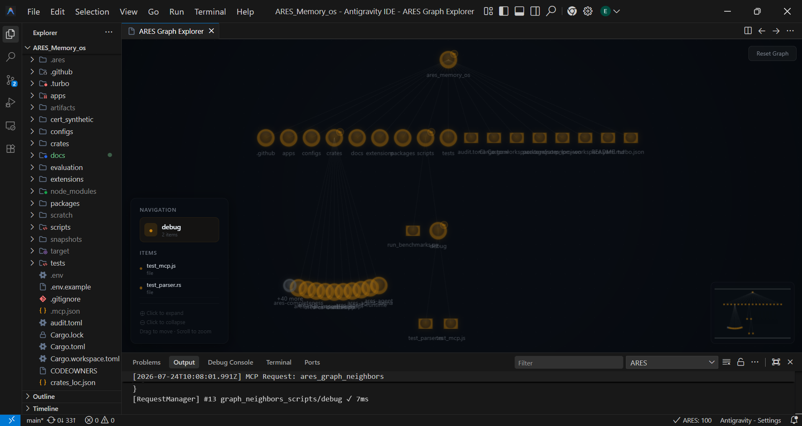
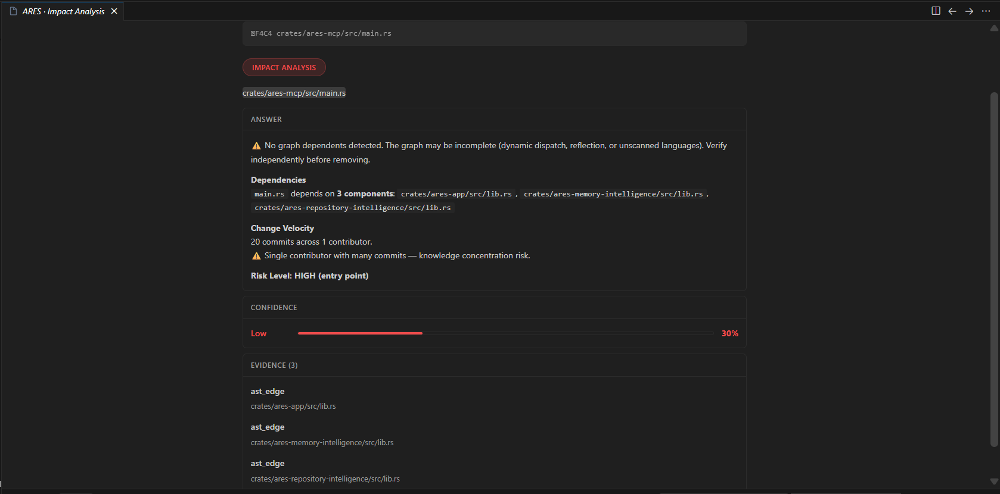
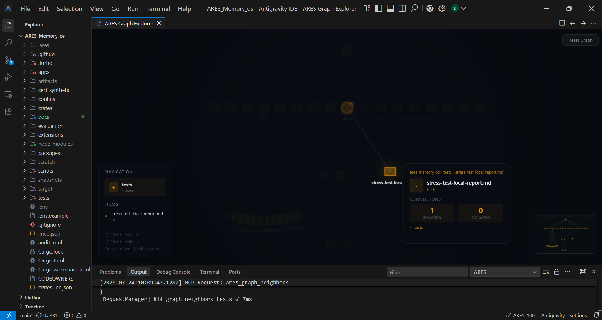
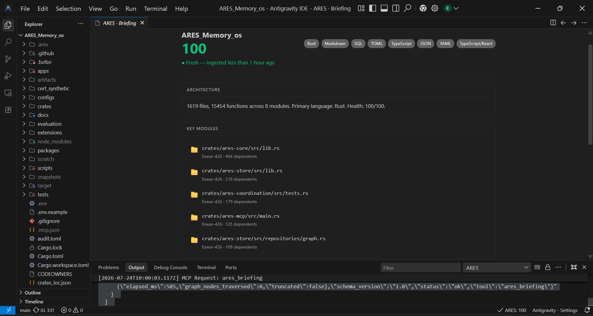

# ARES Memory OS

Deterministic repository intelligence for AI coding agents. Zero LLM required.



---

## What It Does

ARES parses your repository into a queryable knowledge graph — AST relationships, git history, contributor ownership, and architectural decisions across 11 programming languages. When an AI agent asks *"What breaks if I change this trait?"*, ARES traverses the actual dependency graph and returns the exact blast radius — not a guess.

## The Problem

Modern development moves fast. When a Staff Engineer leaves, the context leaves with them. Traditional AI coding tools operate on unstructured text chunks. When you ask *"Why does this module exist?"* or *"What happens if I change this core database trait?"*, they guess based on keyword proximity.

ARES replaces guessing with deterministic graph analysis:
- **Abstract Syntax Trees (ASTs)** across 11 languages
- **Module & Trait dependency graphs**
- **Architectural Decision Records (ADRs)**
- **Git commit history & contributor ownership**
- **Markdown requirements & traceability**

---

## Installation & Quick Start

### VS Code / Antigravity IDE Extension

1. Download the latest `.vsix` from [GitHub Releases](https://github.com/Eswar-426/ARES-MEMORY-OS/releases)
2. Open VS Code / Antigravity IDE → `Extensions` → `...` → `Install from VSIX`
3. Select `ares-memory-vscode-0.1.0.vsix`

No Rust toolchain required. The extension bundles native binaries for Windows, macOS, and Linux.

### Usage

1. Open a repository in VS Code or Antigravity IDE.
2. The extension automatically detects the workspace and begins background ingestion (non-blocking).
3. Open the Output channel (`View` → `Output` → `ARES`) to monitor ingestion progress.
4. Interact via the Command Palette (`Ctrl+Shift+P`), ARES Query Panel, or let your AI agent call MCP tools directly.

### Running Demo Scenarios

Experience ARES using the built-in demo orchestration script:
```powershell
./demo.ps1 payment-service   # Impact & Traceability
./demo.ps1 inventory-system  # Architecture Drift
./demo.ps1 auth-service      # Why Exists Context
```

---

## Workspace Architecture

```text
crates/ares-core       -> Core Graph Data Structures
crates/ares-store      -> Immutable SQLite Persistence (ares.db)
crates/ares-scanner    -> Multi-language parser (Tree-sitter 11 languages)
crates/ares-reasoning  -> Deterministic Intelligence Engines
crates/ares-mcp        -> Model Context Protocol Server (39 Tools)
crates/ares-cli        -> High-speed CLI (ingest, benchmark, doctor)
extensions/            -> VS Code Extension & Webview UI
```

---

## Supported Languages (11 Total)

ARES includes native Tree-sitter AST extractors for:
- **Rust** (`.rs`)
- **Python** (`.py`, `.pyw`)
- **TypeScript** (`.ts`, `.tsx`)
- **JavaScript** (`.js`, `.jsx`)
- **Go** (`.go`)
- **Java** (`.java`)
- **C / C++** (`.c`, `.cpp`, `.h`, `.hpp`)
- **C#** (`.cs`)
- **PHP** (`.php`)
- **Ruby** (`.rb`)
- **Kotlin** (`.kt`, `.kts`)

---

## Complete MCP Tool Suite (39 Tools Total)

### 1. Understanding Code (7 Tools)


| Tool | Description |
|------|-------------|
| `ares_why_exists` | Architectural reason a file/component exists with commit history |
| `ares_impact` | Blast radius — what breaks if this file or function changes |
| `ares_drift` | Measures divergence between written decisions and current code |
| `ares_who_owns` | Contributor percentage breakdown from git blame history |
| `ares_timeline` | Chronological commit evolution timeline for a file |
| `ares_compare` | Coupling score and shared dependencies between two files |
| `ares_simulate` | Deterministic simulation of dependency changes or removals |

### 2. Codebase Health (8 Tools)
| Tool | Description |
|------|-------------|
| `ares_health_check` | Composite repository health score (0-100) and gap breakdown |
| `ares_dead_code` | Detects unreferenced nodes and orphaned functions |
| `ares_architecture` | Overview of file/function counts and highest-coupled modules |
| `ares_scorecard` | Governance compliance scorecard across requirements, decisions, and ownership coverage |
| `ares_coverage` | Verification of decision and requirement coverage across code |
| `ares_compliance` | Evaluates code against architectural policies |
| `ares_dashboard` | Summary status of health metrics and recent trends |
| `ares_gaps` | Identifies undocumented code, stale decisions, or unassigned ownership |

### 3. Knowledge Management (8 Tools)
| Tool | Description |
|------|-------------|
| `ares_decisions` | Queries Architectural Decision Records (ADRs) linked to code |
| `ares_requirements` | Lists requirements linked to implementing functions |
| `ares_traceability` | Traces requirements down to exact file/function nodes |
| `ares_search` | Search files, functions, traits, or classes in the graph |
| `ares_record_decision` | Agent Write API: Create an ADR node linked to target files |
| `ares_record_requirement` | Agent Write API: Link a project requirement to code |
| `ares_annotate` | Agent Write API: Attach key-value annotations to any graph node |
| `ares_correct` | Agent Write API: Append correction metadata to any graph node |

### 4. Graph Exploration (6 Tools)


| Tool | Description |
|------|-------------|
| `ares_graph_root` | Primary graph entry point for visual exploration |
| `ares_graph_neighbors` | Fetches direct incoming and outgoing graph connections |
| `ares_graph_shortest_path` | Finds shortest dependency path between any two nodes |
| `ares_graph_search` | Direct search over graph node labels and properties |
| `ares_graph_metadata` | Summary metadata for node and edge distribution |
| `ares_graph_statistics` | Quantitative graph density and degree statistics |

### 5. Session & Workspace Continuity (10 Tools)


| Tool | Description |
|------|-------------|
| `ares_briefing` | Instant context briefing for new agent sessions |
| `ares_generate_context_file` | Automatically generates `.ares/CLAUDE.md` context summary |
| `ares_chat` | Interactive repository conversation engine |
| `ares_end_session` | Flushes session state and memory to database for handoff |
| `ares_session_context` | Retrieves history from previous agent sessions |
| `ares_workspace_pin` | Pins critical files to active agent context |
| `ares_workspace_bookmark` | Bookmarks key nodes for quick retrieval |
| `ares_workspace_navigate` | Navigates workspace bookmark locations |
| `ares_workspace_record_navigation` | Logs navigation trails during agent exploration |
| `ares_workspace_list` | Lists all pinned and bookmarked workspace items |

---

## Evaluation Platform

ARES includes a deterministic Evaluation Harness (`evaluation/`). Unlike standard LLM benchmarks which can be flaky, ARES converts all intelligence outputs into a **Versioned Canonical Fact Model** mapped to strict graph node IDs, producing mathematically verifiable scores across:

- **Recall & Precision**
- **Evidence Coverage**
- **Hallucination Penalties**
- **SHA-256 Stability Fingerprinting**

Run the evaluator:
```bash
cargo run --bin ares-evaluation -- run --dataset evaluation/datasets/ares/cases.json --repo .
```
Compare regressions:
```bash
cargo run --bin ares-evaluation -- compare --latest 2026-06-27_16-15-08 --previous 2026-06-27_16-08-04
```

---

## License

Distributed under the [MIT License](LICENSE). Copyright (c) 2026 Eswar-426.
