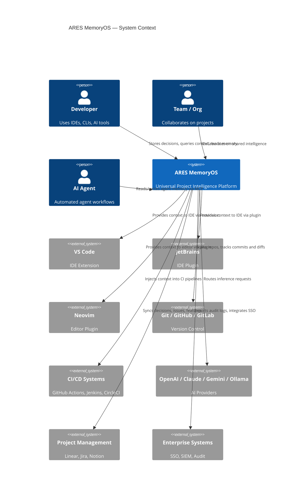
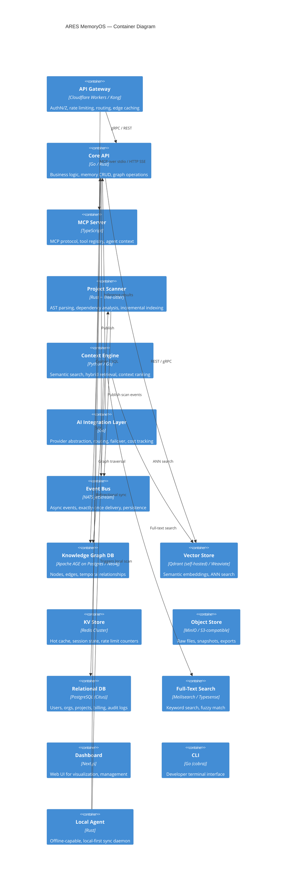
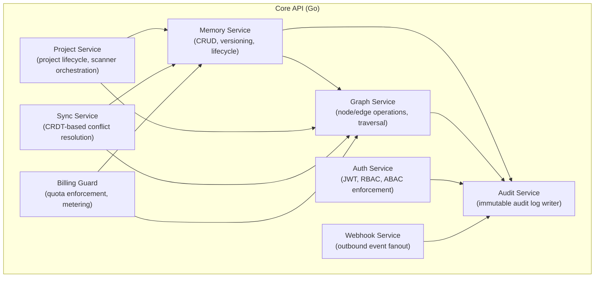
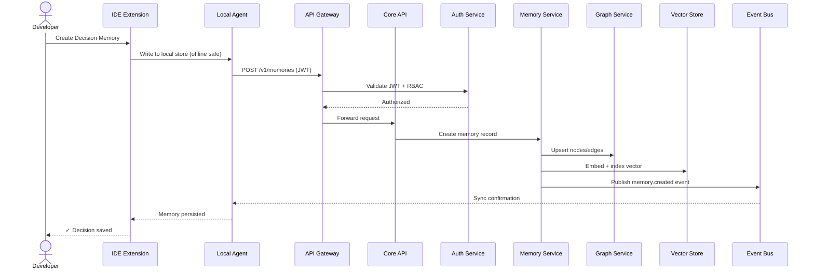
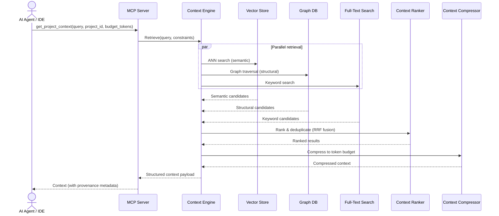
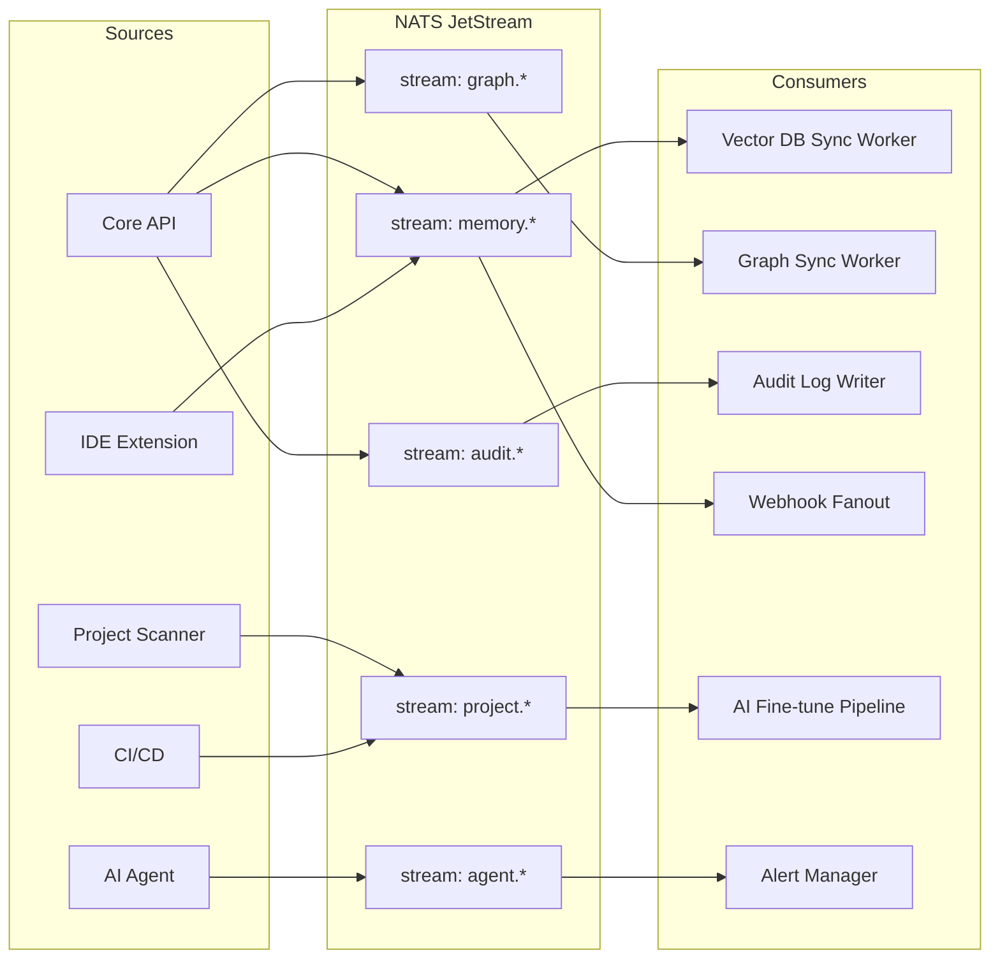
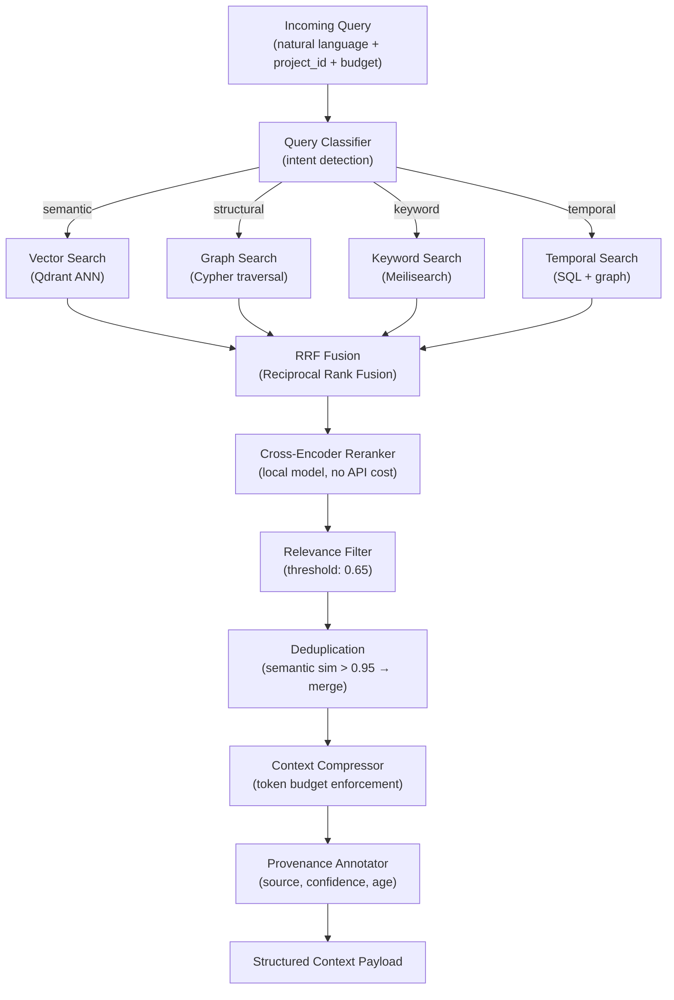

# ARES MemoryOS
## Universal Project Intelligence Platform
### Production-Grade Architecture — Engineering Council Edition

> **Council Members**: Google Fellow · Microsoft Distinguished Engineer · OpenAI Infrastructure Architect · Stripe Principal Engineer · Cloudflare Systems Architect · GitHub Platform Architect · Netflix Distributed Systems Architect · Kubernetes Core Maintainer · Security Researcher · Database Architect · Enterprise SaaS CTO · AI Agent Researcher

---

# PART 1 — VISION

## 1.1 Product Vision

ARES MemoryOS is the **persistent intelligence substrate** for all software projects.

Today, project knowledge lives in human heads, scattered documentation, outdated wikis, Slack threads, and ephemeral AI conversations. When an engineer leaves, knowledge leaves. When an AI session ends, context vanishes. When a team scales, understanding fragments.

ARES solves this permanently.

**ARES is the operating system layer for project intelligence** — the same way an OS abstracts hardware from applications, ARES abstracts raw project artifacts (code, commits, decisions, bugs, conversations) into structured, queryable, evolvable intelligence that any AI model, any IDE, any team member, and any automated agent can access with zero context bootstrapping.

The vision in one sentence: **No project should ever lose its understanding.**

---

## 1.2 Mission

> Make project intelligence as durable as source code itself.

Project understanding must be:
- **Persistent** — survives team turnover, AI model changes, tool changes
- **Portable** — moves with the project, not the user account
- **Universal** — readable by humans, AI models, and agents identically
- **Owned** — by the project, not the platform

---

## 1.3 Core Principles

| # | Principle | Implication |
|---|-----------|-------------|
| P1 | **Knowledge Belongs to the Project** | Data is project-owned, exportable, never siloed in provider accounts |
| P2 | **Model Independence** | Zero coupling to any AI provider. Models are interchangeable infrastructure. |
| P3 | **Offline First** | Full functionality without internet. Sync is an enhancement, not a requirement. |
| P4 | **Zero Trust by Design** | Every access request is verified. No implicit trust. No shared secrets. |
| P5 | **Open Core** | The intelligence layer is open. Monetization happens at collaboration, enterprise, and scale. |
| P6 | **Incremental Adoption** | Works with one file. Scales to 10 billion nodes. No big-bang migrations. |
| P7 | **Explicit over Implicit** | Every inference is traceable. No black-box knowledge mutations. |
| P8 | **Evolvability** | Every component has a documented replacement strategy with zero downtime migration path. |

---

## 1.4 Long-Term Strategy

**Years 1–2**: Capture the AI-native developer workflow. Become the standard context layer for AI coding assistants. Every developer who uses AI tools has a ARES local agent running.

**Years 3–4**: Become the team memory layer. Project intelligence shared across teams with provenance. Integration with GitHub, GitLab, Linear, Jira, Notion.

**Years 5–6**: Become the enterprise compliance and audit layer. Decisions are tracked, auditable, and defensible. Regulatory compliance baked in.

**Years 7–10**: The platform effect. ARES knowledge graphs power the next generation of AI models fine-tuned on project-specific intelligence. ARES becomes the **training data layer** for project-specialized AI.

---

# PART 2 — ARCHITECTURE REVIEW

## 2.1 Context Diagram



---

## 2.2 Container Diagram



---

## 2.3 Component Diagram — Core API



---

## 2.4 Sequence Diagram — Memory Write



---

## 2.5 Sequence Diagram — Context Retrieval (AI Query)



---

## 2.6 Event Flow Diagram



---

## 2.7 Layer Explanation

| Layer | Technology | Why This Exists | What Happens on Failure |
|-------|-----------|-----------------|------------------------|
| Edge/Gateway | Cloudflare Workers | AuthN/Z, DDoS, rate limiting without cold starts | Failover to Kong on-prem; cached responses for read paths |
| Core API | Go | High throughput, low GC pause, strong concurrency | Horizontal scaling; stateless; K8s restarts automatically |
| MCP Server | TypeScript | MCP protocol is TS-native; agent ecosystem familiarity | Restart; local agent buffers requests |
| Event Bus | NATS JetStream | Exactly-once, persistent, low-latency, cloud-agnostic | Messages persisted; consumers replay from offset |
| Knowledge Graph | AGE on Postgres | SQL compatibility, ACID, graph queries, no separate DB | Read replicas serve queries; leader election via Patroni |
| Vector Store | Qdrant | HNSW index, filtering, Rust performance, self-hostable | Stale vectors served; async re-index on recovery |
| Relational DB | PostgreSQL (Citus) | ACID, mature, shardable, no vendor lock-in | Patroni HA; PITR recovery; 3-replica minimum |
| Object Store | MinIO | S3-compatible, self-hostable, no lock-in | Multi-site replication; pre-signed URL fallback |
| Local Agent | Rust | Offline capability, memory safety, low resource use | CRDTs enable conflict-free merge on reconnect |

---

# PART 3 — REPOSITORY ARCHITECTURE

## 3.1 Monorepo Structure

```
ares-memoryos/
├── apps/
│   ├── api/                    # Core API (Go)
│   │   ├── cmd/server/
│   │   ├── internal/
│   │   │   ├── memory/
│   │   │   ├── graph/
│   │   │   ├── project/
│   │   │   ├── auth/
│   │   │   ├── audit/
│   │   │   ├── sync/
│   │   │   └── billing/
│   │   ├── pkg/                # Exported packages
│   │   └── Dockerfile
│   │
│   ├── mcp-server/             # MCP Server (TypeScript)
│   │   ├── src/
│   │   │   ├── tools/
│   │   │   ├── registry/
│   │   │   ├── permissions/
│   │   │   └── transport/      # stdio, HTTP SSE, WebSocket
│   │   └── package.json
│   │
│   ├── dashboard/              # Web Dashboard (Next.js)
│   │   ├── app/
│   │   ├── components/
│   │   ├── lib/
│   │   └── package.json
│   │
│   ├── local-agent/            # Local Agent (Rust)
│   │   ├── src/
│   │   │   ├── sync/
│   │   │   ├── scanner/
│   │   │   ├── store/          # Local SQLite + CRDT
│   │   │   └── ipc/
│   │   └── Cargo.toml
│   │
│   └── context-engine/         # Context Engine (Python/Go)
│       ├── retrieval/
│       ├── ranking/
│       ├── compression/
│       └── embedding/
│
├── packages/
│   ├── sdk-typescript/         # Official TypeScript SDK
│   │   ├── src/
│   │   │   ├── client/
│   │   │   ├── memory/
│   │   │   ├── context/
│   │   │   └── types/
│   │   └── package.json
│   │
│   ├── sdk-python/             # Official Python SDK
│   │   └── pyproject.toml
│   │
│   ├── sdk-go/                 # Official Go SDK
│   │   └── go.mod
│   │
│   ├── sdk-rust/               # Official Rust SDK (crates.io)
│   │   └── Cargo.toml
│   │
│   ├── scanner-core/           # Scanner engine (Rust, shared)
│   │   └── Cargo.toml
│   │
│   ├── proto/                  # Protobuf definitions (source of truth)
│   │   ├── memory/v1/
│   │   ├── graph/v1/
│   │   ├── context/v1/
│   │   └── mcp/v1/
│   │
│   ├── schema/                 # JSON Schema / OpenAPI specs
│   │   ├── memory-types/
│   │   └── openapi/
│   │
│   └── config/                 # Shared config schemas (TypeScript)
│
├── extensions/
│   ├── vscode/                 # VS Code Extension (TypeScript)
│   │   ├── src/
│   │   │   ├── providers/
│   │   │   ├── commands/
│   │   │   ├── webviews/
│   │   │   └── mcp/
│   │   └── package.json
│   │
│   ├── jetbrains/              # JetBrains Plugin (Kotlin)
│   │   ├── src/
│   │   └── build.gradle.kts
│   │
│   ├── neovim/                 # Neovim Plugin (Lua)
│   │   └── lua/ares/
│   │
│   └── _template/              # Template for future IDE extensions
│
├── cli/                        # CLI (Go, cobra)
│   ├── cmd/
│   │   ├── init.go
│   │   ├── scan.go
│   │   ├── memory.go
│   │   ├── context.go
│   │   └── sync.go
│   └── internal/
│
├── infra/
│   ├── k8s/                    # Kubernetes manifests
│   │   ├── base/
│   │   └── overlays/           # Kustomize overlays (dev/staging/prod)
│   ├── terraform/              # IaC (cloud-agnostic modules)
│   │   ├── modules/
│   │   │   ├── postgres/
│   │   │   ├── nats/
│   │   │   ├── qdrant/
│   │   │   └── minio/
│   │   └── envs/
│   ├── helm/                   # Helm charts for enterprise self-host
│   └── docker/                 # Docker Compose for local dev
│
├── docs/
│   ├── architecture/
│   ├── api/
│   ├── sdk/
│   └── adr/                    # Architecture Decision Records
│
├── scripts/
│   ├── dev/
│   └── release/
│
├── .github/
│   ├── workflows/
│   │   ├── ci.yml
│   │   ├── release.yml
│   │   └── security.yml
│   └── CODEOWNERS
│
├── pnpm-workspace.yaml
├── go.work                     # Go workspace
├── Cargo.workspace.toml        # Rust workspace
└── turbo.json                  # Turborepo build orchestration
```

---

## 3.2 Dependency Rules

```
Rule 1: packages/proto      → has zero dependencies (pure protobuf)
Rule 2: packages/schema     → depends only on proto
Rule 3: packages/sdk-*      → depends on proto, schema only
Rule 4: apps/*              → depends on packages/*, never on other apps/*
Rule 5: extensions/*        → depends on sdk-typescript only
Rule 6: cli/                → depends on sdk-go only
Rule 7: infra/              → no code dependencies; config only
Rule 8: No circular dependencies — enforced by Turborepo + custom lint
```

**Enforcement**:
- `depcheck` in CI for all packages
- Custom ESLint rule: no cross-app imports
- Go `internal/` package restriction
- Rust `pub(crate)` visibility enforcement

---

## 3.3 Versioning Strategy

| Component | Strategy | Rationale |
|-----------|----------|-----------|
| REST/gRPC API | URI versioning (`/v1/`, `/v2/`) | Explicit; easy routing; no content negotiation complexity |
| Proto definitions | `package ares.memory.v1` | Backward compat enforced by buf lint |
| SDKs | Semantic Versioning (SemVer) | Industry standard; consumers can pin |
| IDE Extensions | Marketplace versioning | Dictated by marketplace constraints |
| Internal packages | Private; CalVer (`2025.06.01`) | Internal; communicates recency |
| Database schemas | Flyway/Atlas migrations | Versioned, ordered, auditable |

**Breaking change policy**: V1 APIs are supported for a minimum of 24 months. Deprecation notices at 12 months. SDKs warn at 6 months. No silent removals.

---

# PART 4 — MEMORY ARCHITECTURE

## 4.1 Memory Type Taxonomy

ARES defines **8 first-class memory types**, each with its own schema, lifecycle, and storage strategy.

---

### 4.1.1 Project Memory

**Purpose**: The foundational understanding of what a project is.

**Schema**:
```typescript
interface ProjectMemory {
  id: UUID;
  project_id: UUID;
  version: SemVer;
  
  // Identity
  name: string;
  description: string;
  domain: string;               // e.g., "fintech", "healthcare"
  maturity: "greenfield" | "growth" | "mature" | "legacy";
  
  // Technical fingerprint
  primary_language: string;
  languages: LanguageProfile[];
  frameworks: FrameworkProfile[];
  architecture_style: string;   // "microservices", "monolith", "serverless"
  
  // Team context
  team_size: number;
  org_id: UUID;
  repo_urls: string[];
  
  // Metadata
  created_at: Timestamp;
  updated_at: Timestamp;
  schema_version: number;       // for migration
  embedding_id: UUID;           // link to vector store
  graph_node_id: string;        // link to graph DB
}
```

**Lifecycle**:
- **Created**: On project initialization (`ares init`)
- **Updated**: On significant structural changes detected by scanner
- **Versioned**: Every update creates a new immutable version; current pointer updated
- **Deleted**: Soft-delete with 90-day retention; exported to object store before purge
- **Recovery**: Point-in-time restore from immutable version chain

**Storage**: PostgreSQL (source of truth) + Redis (hot cache, 1hr TTL) + Vector store (semantic)

---

### 4.1.2 Feature Memory

**Purpose**: Understands what features exist, their scope, status, and implementation details.

**Schema**:
```typescript
interface FeatureMemory {
  id: UUID;
  project_id: UUID;
  
  // Identity
  title: string;
  description: string;
  status: "planned" | "in_progress" | "completed" | "deprecated" | "cancelled";
  priority: "critical" | "high" | "medium" | "low";
  
  // Scope
  files_involved: FileReference[];
  services_involved: ServiceReference[];
  api_endpoints: EndpointReference[];
  database_tables: TableReference[];
  
  // Relationships
  depends_on: UUID[];           // other feature IDs
  blocks: UUID[];
  related_bugs: UUID[];
  related_decisions: UUID[];
  
  // History
  implementation_notes: Note[];
  timeline: TimelineEvent[];
  
  // Links
  external_refs: ExternalRef[]; // Linear, Jira, GitHub issues
  
  // Metadata
  created_by: UserRef;
  created_at: Timestamp;
  updated_at: Timestamp;
  version: number;
  embedding_id: UUID;
  graph_node_id: string;
}
```

**Lifecycle**:
- **Created**: Manually by developer or auto-detected from PR descriptions + issue trackers
- **Updated**: Incremental updates as implementation progresses
- **Completed**: Status transition; files_involved frozen; links to completed PR
- **Deprecated**: Soft deprecation with reason; maintained for historical context
- **Recovery**: Full history in append-only version table; graph edges preserved

---

### 4.1.3 Bug Memory

**Purpose**: Preserves the complete context of bugs — not just the fix, but why it happened and how to detect recurrence.

**Schema**:
```typescript
interface BugMemory {
  id: UUID;
  project_id: UUID;
  
  // Classification
  title: string;
  description: string;
  severity: "critical" | "high" | "medium" | "low";
  category: "logic" | "performance" | "security" | "data" | "integration" | "concurrency";
  
  // Root cause
  root_cause: string;
  root_cause_category: "human_error" | "design_flaw" | "dependency" | "environment" | "race_condition";
  contributing_factors: string[];
  
  // Impact
  files_affected: FileReference[];
  services_affected: ServiceReference[];
  users_impacted: ImpactEstimate;
  revenue_impact: RevenueImpact | null;
  
  // Fix
  fix_description: string;
  fix_pr_url: string;
  fix_commit: string;
  prevention_measures: PreventionMeasure[];
  
  // Detection
  detection_method: "user_report" | "monitoring" | "testing" | "code_review" | "ai_detection";
  detection_query: string | null;   // monitoring query to detect recurrence
  alert_threshold: AlertConfig | null;
  
  // Timeline
  introduced_at: CommitRef | null;
  detected_at: Timestamp;
  fixed_at: Timestamp | null;
  time_to_detect: Duration;
  time_to_fix: Duration;
  
  status: "open" | "in_progress" | "fixed" | "wont_fix" | "duplicate";
  embedding_id: UUID;
  graph_node_id: string;
}
```

**Lifecycle**: Bugs are immutable once fixed. Post-mortem appended. Never deleted. Permanent historical record.

---

### 4.1.4 Decision Memory

**Purpose**: The most critical memory type. Preserves *why* technical decisions were made — the institutional knowledge that is otherwise lost.

*(Full schema in Part 14 — Decision DNA)*

---

### 4.1.5 Architecture Memory

**Purpose**: Captures the structural understanding of the system — components, boundaries, patterns.

**Schema**:
```typescript
interface ArchitectureMemory {
  id: UUID;
  project_id: UUID;
  
  // Structure
  components: Component[];
  boundaries: Boundary[];
  communication_patterns: CommunicationPattern[];
  data_flows: DataFlow[];
  
  // Quality attributes
  scalability_strategy: string;
  availability_target: string;   // "99.9%", "99.99%"
  consistency_model: string;     // "strong", "eventual", "causal"
  
  // Constraints
  known_constraints: Constraint[];
  technical_debt: TechDebtItem[];
  
  // Diagrams
  diagram_refs: DiagramRef[];    // links to C4 diagrams in object store
  
  // Evolution
  intended_evolution: EvolutionPlan[];
  
  version: number;
  snapshot_at: Timestamp;
  derived_from_scan: ScanRef | null;  // auto-generated vs manual
  embedding_id: UUID;
  graph_node_id: string;
}
```

---

### 4.1.6 Agent Memory

**Purpose**: Tracks what AI agents have done, learned, and decided within the project scope. Enables agent continuity across sessions.

**Schema**:
```typescript
interface AgentMemory {
  id: UUID;
  project_id: UUID;
  agent_id: string;             // agent identifier (e.g., "claude-3-5-sonnet", "custom-agent-xyz")
  session_id: UUID;
  
  // What the agent did
  task_description: string;
  actions_taken: AgentAction[];
  files_modified: FileReference[];
  memories_created: UUID[];
  memories_read: UUID[];
  
  // What the agent learned
  observations: Observation[];
  inferences: Inference[];
  
  // Artifacts
  code_generated: CodeArtifact[];
  decisions_made: UUID[];       // Decision Memory references
  
  // Trust and quality
  confidence_scores: Record<string, number>;
  human_reviewed: boolean;
  review_outcome: "approved" | "rejected" | "modified" | null;
  
  // Provenance
  model_id: string;
  model_version: string;
  provider: string;
  
  started_at: Timestamp;
  ended_at: Timestamp;
  token_cost: TokenCost;
  embedding_id: UUID;
  graph_node_id: string;
}
```

**Critical**: Agent memories are write-once. Agents cannot modify their own historical records. Human review flag is set by humans only.

---

### 4.1.7 Team Memory

**Purpose**: Captures team-level knowledge: conventions, standards, ownership, expertise distribution.

**Schema**:
```typescript
interface TeamMemory {
  id: UUID;
  org_id: UUID;
  project_id: UUID | null;      // null = org-wide
  
  // Conventions
  coding_standards: Standard[];
  naming_conventions: Convention[];
  review_requirements: ReviewRequirement[];
  
  // Ownership
  ownership_map: OwnershipEntry[];    // files/services → teams/individuals
  expertise_map: ExpertiseEntry[];    // domains → experts
  
  // Onboarding
  onboarding_paths: OnboardingPath[];
  critical_knowledge: CriticalKnowledge[];
  
  // Dynamics
  communication_channels: Channel[];
  decision_authority: DecisionAuthority[];
  
  version: number;
  last_reviewed: Timestamp;
  embedding_id: UUID;
  graph_node_id: string;
}
```

---

### 4.1.8 Workflow Memory

**Purpose**: Captures how work gets done — processes, pipelines, runbooks, incident response.

**Schema**:
```typescript
interface WorkflowMemory {
  id: UUID;
  project_id: UUID;
  
  type: "development" | "deployment" | "incident" | "review" | "onboarding" | "release";
  title: string;
  description: string;
  
  // Steps
  steps: WorkflowStep[];
  decision_points: DecisionPoint[];
  automation_hooks: AutomationHook[];
  
  // Tools
  tools_used: ToolRef[];
  scripts: ScriptRef[];
  
  // SLAs
  expected_duration: Duration;
  sla: SLA | null;
  
  // History
  last_executed: Timestamp;
  execution_history: ExecutionRecord[];
  
  embedding_id: UUID;
  graph_node_id: string;
}
```

---

## 4.2 Memory Storage Architecture

```
┌─────────────────────────────────────────────────────────────┐
│                    Memory Storage Layers                     │
│                                                             │
│  L1: Local Agent Cache (SQLite + CRDT)                      │
│      • Offline access                                       │
│      • Sub-millisecond reads                                │
│      • Conflict-free sync                                   │
│                                                             │
│  L2: Redis Cluster (Hot Cache)                              │
│      • Recently accessed memories                           │
│      • Project summaries                                    │
│      • 1-hour TTL with LRU eviction                         │
│                                                             │
│  L3: PostgreSQL (Citus)  ←  Source of Truth                 │
│      • All memory records                                   │
│      • Full version history                                 │
│      • ACID guarantees                                      │
│                                                             │
│  L4: Qdrant (Vector Store)                                  │
│      • Semantic embeddings                                  │
│      • ANN retrieval                                        │
│      • Metadata filtering                                   │
│                                                             │
│  L5: MinIO (Object Store)                                   │
│      • Raw snapshots                                        │
│      • Large artifacts (diagrams, exports)                  │
│      • Immutable audit archives                             │
└─────────────────────────────────────────────────────────────┘
```

---

# PART 5 — KNOWLEDGE GRAPH

## 5.1 Graph Schema

```
NODE TYPES:
├── :Project       { id, name, domain, maturity }
├── :File          { path, language, loc, hash }
├── :Function      { name, signature, complexity, file_id }
├── :Class         { name, file_id }
├── :Module        { name, language, version }
├── :Service       { name, type, url }
├── :Decision      { id, title, status, confidence }
├── :Feature       { id, title, status }
├── :Bug           { id, severity, status }
├── :Agent         { id, model, provider }
├── :Developer     { id, role, expertise[] }
├── :Team          { id, name, domain }
├── :Concept       { id, name, description }     # semantic concept nodes
└── :Tag           { name }                       # flexible labeling

EDGE TYPES:
├── IMPORTS              (File → Module)
├── DEFINES              (File → Function | Class)
├── CALLS                (Function → Function)
├── EXTENDS              (Class → Class)
├── DEPENDS_ON           (Service → Service | Module)
├── IMPLEMENTS           (File | Function → Feature)
├── CAUSED               (Bug → Bug)              # cascading bugs
├── FIXED_BY             (Bug → Decision)
├── SUPERCEDES           (Decision → Decision)
├── MOTIVATED_BY         (Decision → Bug | Feature)
├── IMPACTS              (Decision → File | Service | Feature)
├── OWNS                 (Developer | Team → File | Service)
├── AUTHORED             (Developer → Decision | Bug | Feature)
├── EXECUTED             (Agent → Feature | Bug | Decision)
├── LEARNED              (Agent → Concept)
├── RELATED_TO           (any → any, weight: float)
├── TEMPORAL_FOLLOWS     (any → any, at: Timestamp)
└── CONTRADICTS          (Decision → Decision)    # detected conflicts

TEMPORAL EDGES:
All edges carry:
  - created_at: Timestamp
  - valid_from: Timestamp
  - valid_until: Timestamp | null  (null = currently valid)
  - confidence: float (0.0 - 1.0)
  - source: "human" | "scanner" | "agent" | "inference"
```

---

## 5.2 Graph Traversal Algorithms

```typescript
// Algorithm 1: Impact Analysis
// "If I change this file, what breaks?"
function getImpactRadius(nodeId: string, depth: number = 3): ImpactGraph {
  const query = `
    MATCH path = (start {id: $nodeId})-[r*1..${depth}]->(impacted)
    WHERE type(r) IN ['IMPORTS', 'DEPENDS_ON', 'CALLS', 'IMPLEMENTS']
    RETURN path, 
           length(path) as distance,
           relationships(path) as edge_chain
    ORDER BY distance ASC
    LIMIT 500
  `;
  // Returns: hierarchical impact tree with confidence decay per hop
  // Confidence: start(1.0) → hop1(0.9) → hop2(0.8) → hop3(0.7)
}

// Algorithm 2: Context Subgraph Extraction
// "What do I need to understand to work on feature X?"
function getContextSubgraph(featureId: string, tokenBudget: number): ContextGraph {
  // Phase 1: Direct connections (1-hop)
  // Phase 2: Weighted expansion (2-hop, descending weight)
  // Phase 3: Prune to token budget using PageRank-style scoring
  // Phase 4: Include temporal path (recent decisions that affect scope)
}

// Algorithm 3: Temporal Path Analysis
// "How did we get here? What decisions led to this architecture?"
function getTemporalPath(nodeId: string, since: Timestamp): TemporalPath {
  const query = `
    MATCH path = (n {id: $nodeId})<-[r:TEMPORAL_FOLLOWS|IMPACTS|SUPERCEDES*]-(ancestor)
    WHERE r.created_at >= $since
    RETURN path ORDER BY r.created_at ASC
  `;
}

// Algorithm 4: Knowledge Gap Detection
// "What parts of the codebase have no documented understanding?"
function detectKnowledgeGaps(projectId: string): GapReport {
  // Find: Files with no IMPLEMENTS edge
  // Find: Functions with no associated Decision or Feature
  // Find: Services with no OWNS relationship (orphaned ownership)
  // Find: Nodes with stale embeddings (> 30 days without update)
}

// Algorithm 5: Contradiction Detection
// "Are there conflicting decisions in this codebase?"
function detectContradictions(projectId: string): ConflictReport {
  // Find Decision pairs where:
  // - both are ACTIVE status
  // - both IMPACT the same node
  // - have CONTRADICTS edge OR semantic similarity > 0.85 with opposite sentiments
}
```

---

## 5.3 Graph Update Strategies

| Update Type | Strategy | Consistency |
|-------------|----------|-------------|
| Node creation | Write-ahead log → Postgres → async graph sync | Eventual (< 2s) |
| Edge creation | Transactional with node creation | Atomic |
| Node deletion | Tombstone + 30-day retention → edge cleanup | Soft delete first |
| Bulk import (scan) | Batch upsert with conflict resolution | Idempotent |
| Embedding refresh | Background job, versioned, atomic swap | Non-blocking |
| Temporal expiry | Scheduled job, sets `valid_until` | Background |

**Anti-patterns prevented**:
- No orphaned edges (FK constraints in Postgres backing store)
- No duplicate nodes (content-addressed IDs for code nodes)
- No stale embeddings (embedding version tracked; async refresh on schema change)

---

# PART 6 — PROJECT SCANNER

## 6.1 Parsing Strategy

The scanner is a **Rust binary** using **Tree-sitter** for all language parsing. Tree-sitter provides:
- Incremental parsing (re-parse only changed regions)
- Error recovery (continues past syntax errors)
- Unified API across all languages
- WASM compilation (browser/edge deployment possible)

```
Scanner Architecture:
┌────────────────────────────────────────────────────────┐
│                    Scanner Core (Rust)                  │
│                                                        │
│  ┌─────────────────┐    ┌──────────────────────────┐  │
│  │  File Watcher   │    │   Change Detection       │  │
│  │  (notify crate) │───▶│   (content hash + mtime) │  │
│  └─────────────────┘    └──────────┬───────────────┘  │
│                                    │                   │
│                          ┌─────────▼──────────┐        │
│                          │  Parse Queue       │        │
│                          │  (rayon threadpool)│        │
│                          └─────────┬──────────┘        │
│                                    │                   │
│     ┌──────────┬──────────┬───────▼─────┬──────────┐  │
│     │    TS    │   Python  │    Go       │  Rust    │  │
│     │ tree-sitter parsers (per language grammar)   │  │
│     └──────────┴──────────┴─────────────┴──────────┘  │
│                                    │                   │
│                          ┌─────────▼──────────┐        │
│                          │  AST Transformer   │        │
│                          │  → ARES Node/Edge  │        │
│                          └─────────┬──────────┘        │
│                                    │                   │
│                          ┌─────────▼──────────┐        │
│                          │  Graph Diff Engine │        │
│                          │  (delta only)      │        │
│                          └─────────┬──────────┘        │
│                                    │                   │
│                          ┌─────────▼──────────┐        │
│                          │  Event Publisher   │        │
│                          │  (NATS)            │        │
│                          └────────────────────┘        │
└────────────────────────────────────────────────────────┘
```

---

## 6.2 Language Support Matrix

| Language | Grammar | Constructs Extracted | Dep Analysis |
|----------|---------|---------------------|--------------|
| TypeScript/JS | `tree-sitter-typescript` | Functions, classes, interfaces, imports, exports, decorators | package.json + ESM |
| Python | `tree-sitter-python` | Functions, classes, decorators, imports | requirements.txt, pyproject.toml |
| Go | `tree-sitter-go` | Functions, structs, interfaces, imports | go.mod |
| Java | `tree-sitter-java` | Classes, methods, interfaces, annotations | pom.xml, build.gradle |
| C# | `tree-sitter-c_sharp` | Classes, methods, namespaces, attributes | .csproj, NuGet |
| Rust | `tree-sitter-rust` | Functions, structs, traits, modules | Cargo.toml |
| PHP | `tree-sitter-php` | Classes, functions, traits, namespaces | composer.json |
| Ruby | `tree-sitter-ruby` | Classes, modules, methods | Gemfile |

---

## 6.3 Incremental Scanning

```
Full Scan (initial):
  1. Walk file tree (ignore: .gitignore + .aresignore)
  2. Compute content hash (blake3) for each file
  3. Parallel parse (rayon, N=cpu_count)
  4. Build initial graph
  5. Embed all nodes (batched, async)
  6. Persist to DB + emit events

Incremental Scan (on change):
  1. File watcher fires (inotify/FSEvents/ReadDirectoryChangesW)
  2. Re-hash changed files only
  3. Parse only changed files (Tree-sitter incremental)
  4. Compute graph delta (new nodes, removed nodes, changed edges)
  5. Apply delta to graph (upsert/delete)
  6. Re-embed changed nodes only
  7. Emit targeted change events
  
Target latency: < 500ms from file save to graph update
```

---

## 6.4 Indexing Strategy

```
Primary Index (PostgreSQL):
  - project_id + file_path (unique)
  - project_id + node_type + created_at
  - project_id + updated_at (for incremental sync)

Graph Index (AGE / Neo4j):
  - Node IDs (hash index)
  - Project-scoped node lookup
  - Relationship type indexes

Vector Index (Qdrant):
  - HNSW index per collection
  - Payload indexes: project_id, node_type, created_at, status
  - Segment-based for concurrent updates

Full-Text Index (Meilisearch):
  - Title + description + content per memory type
  - Project-scoped filtering
  - Typo tolerance enabled
```

---

# PART 7 — CONTEXT ENGINE

## 7.1 Retrieval Architecture

The Context Engine implements **Retrieval-Augmented Intelligence (RAI)** — not just RAG.

The distinction: RAG retrieves documents. ARES retrieves **structured, ranked, compressed intelligence** with provenance.



---

## 7.2 Hybrid Search Details

### Semantic Search (Vector)
- Model: `text-embedding-3-small` (OpenAI) or `nomic-embed-text` (local/Ollama)
- Embedding dimensions: 1536 (OpenAI) / 768 (Nomic)
- HNSW parameters: `m=16, ef_construction=200, ef=100`
- Payload filter: always scope by `project_id`
- Latency target: < 50ms p99

### Graph Search (Structural)
- Cypher pattern matching for structural queries
- Automatically triggered when query contains: "depends on", "calls", "imports", "related to", "impacts"
- Max traversal depth: 4 hops (configurable)
- Returns subgraph, not just nodes

### Keyword Search (Exact)
- Meilisearch with typo tolerance
- Search across: title, description, content fields
- Per-type faceting: memory type, status, severity
- Latency target: < 20ms p99

### Temporal Search
- SQL queries with time predicates
- "What changed in the last 30 days?" → date-scoped queries
- "What was the state of X at time T?" → version lookup

---

## 7.3 Context Compression Strategy

Token budget management is the most critical constraint for AI integration.

```typescript
interface CompressionStrategy {
  // Budget allocation per source type
  allocation: {
    decision_memory: 0.30,    // 30% of budget — highest value
    architecture: 0.20,
    feature_memory: 0.20,
    bug_memory: 0.15,
    code_context: 0.10,
    agent_memory: 0.05,
  };
  
  // Compression techniques per memory type
  techniques: {
    // 1. Hierarchical summarization: include summary first, details on demand
    hierarchical: true;
    // 2. Deduplication: merge semantically similar content
    dedup_threshold: 0.95;
    // 3. Age penalty: older memories get lower token allocation
    age_decay: "exponential";  // half-life: 90 days
    // 4. Recency boost: memories updated in last 7 days get +0.2 score
    recency_boost: 7;          // days
    // 5. Relevance cutoff: below 0.65 score → excluded
    relevance_cutoff: 0.65;
  };
}

// Output format optimized for LLM consumption:
interface ContextPayload {
  project_summary: string;          // < 200 tokens
  relevant_decisions: Decision[];    // most impactful first
  relevant_features: Feature[];
  relevant_architecture: string;    // compressed architecture note
  code_context: CodeSnippet[];
  provenance: ProvenanceEntry[];    // where each piece came from
  token_usage: TokenUsage;          // budget consumed
  confidence: number;               // overall retrieval confidence
}
```

---

## 7.4 Context Ranking (RRF Fusion)

```python
def reciprocal_rank_fusion(
    result_lists: list[list[Result]], 
    k: int = 60,
    weights: dict[str, float] = None
) -> list[Result]:
    """
    Fuses ranked lists from multiple retrieval sources.
    k=60 is the standard RRF constant (Cormack et al., 2009).
    weights allow source prioritization (e.g., graph results > keyword).
    """
    scores: dict[str, float] = {}
    weights = weights or {"vector": 1.0, "graph": 1.2, "keyword": 0.8, "temporal": 0.9}
    
    for source, results in zip(["vector", "graph", "keyword", "temporal"], result_lists):
        weight = weights[source]
        for rank, result in enumerate(results):
            scores[result.id] = scores.get(result.id, 0) + weight * (1 / (k + rank + 1))
    
    return sorted(results_by_id.values(), key=lambda r: scores[r.id], reverse=True)
```

---

# PART 8 — AI INTEGRATION LAYER

## 8.1 Provider Abstraction Architecture

The AI Integration Layer is a **routing and abstraction plane** — not a thin wrapper.

```
┌─────────────────────────────────────────────────────────────┐
│                 AI Integration Layer (Go)                    │
│                                                             │
│  ┌─────────────────────────────────────────────────────┐   │
│  │               Unified AI Interface                   │   │
│  │  Complete(req InferenceRequest) InferenceResponse    │   │
│  │  Embed(req EmbedRequest) EmbedResponse               │   │
│  │  Stream(req InferenceRequest) <-chan StreamChunk      │   │
│  └─────────────────────────────────────────────────────┘   │
│                           │                                 │
│  ┌────────────────────────▼────────────────────────────┐   │
│  │                  Router                              │   │
│  │  • Capability matching (supports tools? vision?)     │   │
│  │  • Cost optimization (cheapest capable model)        │   │
│  │  • Latency routing (fastest for latency-sensitive)   │   │
│  │  • Privacy routing (local-only for sensitive data)   │   │
│  │  • Load balancing (round-robin across API keys)      │   │
│  └────────────────────────┬────────────────────────────┘   │
│                           │                                 │
│  ┌────────────────────────▼────────────────────────────┐   │
│  │               Failover Chain                         │   │
│  │  primary → fallback1 → fallback2 → local(Ollama)     │   │
│  │  Circuit breaker per provider (5s window, 50% error) │   │
│  └────────────────────────┬────────────────────────────┘   │
│                           │                                 │
│  ┌──────┬──────┬──────┬───▼──┬──────┬──────┬──────────┐   │
│  │OpenAI│Claude│Gemini│Grok  │DS    │Ollama│ Future   │   │
│  │Adapter│Adapter│Adapt│Adapt │Adapt │Adapt │ Adapter  │   │
│  └──────┴──────┴──────┴──────┴──────┴──────┴──────────┘   │
│                           │                                 │
│  ┌────────────────────────▼────────────────────────────┐   │
│  │              Observability Layer                     │   │
│  │  • Token cost tracking (per provider, per project)   │   │
│  │  • Latency histograms                               │   │
│  │  • Error rates + circuit states                      │   │
│  │  • Model quality benchmarks (periodic eval)          │   │
│  └─────────────────────────────────────────────────────┘   │
└─────────────────────────────────────────────────────────────┘
```

---

## 8.2 Provider Configuration (No Code Changes to Swap)

```yaml
# ares.providers.yaml — loaded at runtime
providers:
  openai:
    api_key: ${OPENAI_API_KEY}
    models:
      - id: gpt-4o
        capabilities: [completion, tools, vision]
        cost_per_1m_input: 2.50
        cost_per_1m_output: 10.00
        max_context: 128000
        priority: 1
      - id: gpt-4o-mini
        capabilities: [completion, tools]
        cost_per_1m_input: 0.15
        cost_per_1m_output: 0.60
        max_context: 128000
        priority: 3   # used for cost optimization
    circuit_breaker:
      error_threshold: 0.5
      window: 10s
      half_open_after: 30s

  anthropic:
    api_key: ${ANTHROPIC_API_KEY}
    models:
      - id: claude-3-5-sonnet-20241022
        capabilities: [completion, tools, vision]
        priority: 2
    
  ollama:
    base_url: http://localhost:11434
    models:
      - id: llama3.3
        capabilities: [completion]
        priority: 10   # last resort / offline mode
    offline_capable: true

routing_rules:
  - name: "sensitive-data-local"
    condition: "request.privacy_level == 'confidential'"
    force_provider: ollama
  
  - name: "cost-optimize-summaries"
    condition: "request.task_type == 'summarization'"
    prefer_cheapest: true
  
  - name: "latency-optimize-completions"
    condition: "request.latency_requirement == 'realtime'"
    max_latency_ms: 1000
    exclude_providers: [deepseek]  # higher latency
```

---

## 8.3 Cost Optimization Layer

```
Strategies:
1. Prompt caching (OpenAI / Anthropic prefix caching) → 90% cost reduction on repeated context
2. Tiered model routing: summaries → cheap model; complex reasoning → expensive model
3. Context compression (Part 7) → minimize input tokens
4. Response caching: identical queries within 1 hour → serve cached response (Redis)
5. Embedding deduplication: same content hash → reuse existing embedding
6. Batch embedding: accumulate 100 items → single API call
7. Budget enforcement: per-project monthly token budget with hard cutoffs
```

---

# PART 9 — MCP ARCHITECTURE

## 9.1 ARES as MCP Server

ARES implements the **Model Context Protocol** as a first-class server, making all project intelligence accessible to any MCP-compatible AI model.

```
Transport Options:
├── stdio (local, default for CLI + local agent)
├── HTTP SSE (remote, authenticated)
└── WebSocket (real-time, for agent sessions)
```

---

## 9.2 Tool Registry

```typescript
// Core Tool Definitions
const ARES_TOOLS: MCPTool[] = [
  
  // Context Retrieval
  {
    name: "ares_get_project_context",
    description: "Retrieve comprehensive project understanding for a given query. Returns ranked, compressed context from all memory types.",
    inputSchema: {
      query: { type: "string", required: true },
      project_id: { type: "string", required: true },
      token_budget: { type: "number", default: 4000 },
      memory_types: { type: "array", enum: MemoryTypeEnum, default: "all" },
      include_graph: { type: "boolean", default: true }
    }
  },
  
  // Memory Operations
  {
    name: "ares_create_decision",
    description: "Record an architectural or technical decision with full Decision DNA context.",
    inputSchema: {
      project_id: { type: "string", required: true },
      title: { type: "string", required: true },
      decision: { type: "string", required: true },
      reason: { type: "string", required: true },
      alternatives_considered: { type: "array" },
      risks: { type: "array" },
      files_impacted: { type: "array" },
      confidence: { type: "number", min: 0, max: 1 }
    }
  },
  
  {
    name: "ares_query_decisions",
    description: "Search historical decisions by query, file, service, or date range.",
    inputSchema: {
      project_id: { type: "string", required: true },
      query: { type: "string" },
      file_path: { type: "string" },
      since: { type: "string", format: "date-time" }
    }
  },
  
  {
    name: "ares_get_impact_analysis",
    description: "Given a file or component, return what would be impacted by changes to it.",
    inputSchema: {
      project_id: { type: "string", required: true },
      target: { type: "string", required: true },  // file path or component ID
      depth: { type: "number", default: 3 }
    }
  },
  
  {
    name: "ares_get_feature_context",
    description: "Retrieve full context for a feature: related files, decisions, bugs, dependencies.",
    inputSchema: {
      project_id: { type: "string", required: true },
      feature_id: { type: "string" },
      feature_name: { type: "string" }
    }
  },
  
  {
    name: "ares_log_agent_action",
    description: "Log an action taken by this agent session for continuity and audit purposes.",
    inputSchema: {
      session_id: { type: "string", required: true },
      action_type: { type: "string", required: true },
      description: { type: "string", required: true },
      files_affected: { type: "array" },
      confidence: { type: "number" }
    }
  },
  
  {
    name: "ares_get_knowledge_gaps",
    description: "Identify parts of the codebase with no documented understanding.",
    inputSchema: {
      project_id: { type: "string", required: true }
    }
  },
  
  {
    name: "ares_detect_contradictions",
    description: "Find conflicting decisions or architectural patterns in the project.",
    inputSchema: {
      project_id: { type: "string", required: true }
    }
  }
];
```

---

## 9.3 Permission System

```typescript
// MCP Permission Model — Fine-grained
interface MCPPermissionPolicy {
  subject: MCPSubject;         // "agent:claude", "user:alice", "team:backend"
  project_id: string;
  
  permissions: {
    // Memory operations
    memory_read: MemoryTypeSet;    // which memory types can be read
    memory_write: MemoryTypeSet;   // which memory types can be written
    memory_delete: MemoryTypeSet;  // which memory types can be deleted
    
    // Graph operations
    graph_read: boolean;
    graph_write: boolean;
    
    // Sensitive operations
    can_read_agent_memories: boolean;
    can_write_decisions: boolean;    // high trust required
    can_delete_any: boolean;         // admin only
    
    // Rate limits
    requests_per_minute: number;
    token_budget_per_day: number;
  };
  
  // Conditions
  conditions: {
    require_human_review: MemoryTypeSet;   // agent writes flagged for review
    allowed_ip_ranges: string[];
    time_restrictions: TimeRestriction[];
  };
  
  expires_at: Timestamp | null;
}
```

---

# PART 10 — SECURITY ARCHITECTURE

## 10.1 Threat Model

### Threat: Data Theft
- **Vector**: Exfiltration of project intelligence (IP, architecture secrets, API keys accidentally stored in memories)
- **Mitigations**:
  - Encryption at rest (AES-256-GCM) for all memory records
  - TLS 1.3 minimum in transit; mTLS for service-to-service
  - Secret scanning on all inbound memory writes (detect AWS keys, tokens, passwords)
  - Data classification: automatically tag sensitive content; restrict export
  - Customer-managed encryption keys (BYOK) for enterprise
- **Detection**: Anomalous read volume alerts; cross-tenant access detection
- **Recovery**: Audit log replay; affected data cryptographic rotation

### Threat: Prompt Injection via Memory
- **Vector**: Malicious content stored in a memory that later gets injected into AI context, causing the model to exfiltrate data or take harmful actions
- **Mitigations**:
  - Memory sanitization layer: all inbound content scanned for injection patterns
  - Structural output format: context delivered as structured JSON, not raw text injection
  - System prompt hardening: instruct models to treat ARES context as data, not instructions
  - Canary tokens: embed invisible markers in context; if detected in outputs → alert
  - Sandboxed agent sessions: agents operate in read-only mode by default; write requires explicit grant
- **Detection**: Output monitoring for canary token leakage; pattern matching on model outputs
- **Recovery**: Isolate poisoned memory; revert to last clean snapshot

### Threat: Memory Poisoning
- **Vector**: Attacker (insider or compromised agent) writes false information into memories to mislead future AI decisions
- **Mitigations**:
  - Append-only memory model: memories are versioned; no in-place overwrites
  - Confidence scoring: inferred/agent-written memories have lower initial confidence
  - Human review workflow: agent-written decisions require human approval before reaching full trust
  - Multi-party writes: critical memories (architecture decisions) require 2+ approvers
  - Contradiction detection: automatic alerts when new memory contradicts established patterns
- **Detection**: Confidence drift monitoring; semantic anomaly detection on new writes
- **Recovery**: Version rollback; audit trail for forensics

### Threat: Supply Chain Attacks
- **Vector**: Compromised dependencies in SDK, CLI, or extensions
- **Mitigations**:
  - Dependency pinning (exact hashes in lockfiles)
  - Dependabot + OSSF Scorecard on all packages
  - SBOM generation on every release (CycloneDX)
  - Binary transparency: signed releases with cosign + Sigstore
  - Reproducible builds for CLI binaries
  - Extension signing (VS Code Marketplace, JetBrains Marketplace)
- **Detection**: GitHub Advisory Database monitoring; automated CVE scanning in CI
- **Recovery**: Emergency release pipeline (< 4h); customer advisory system

### Threat: API Abuse
- **Vector**: Rate limit bypass, credential stuffing, scraping of other projects' data
- **Mitigations**:
  - API key rotation enforced (max 90-day lifetime)
  - Rate limiting at edge (Cloudflare) + API gateway (per-key, per-IP, per-org)
  - Tenant isolation: all queries scoped by project_id with cryptographic verification
  - Anomaly detection: ML-based usage profiling; alerts on 3σ deviations
  - mTLS for service-to-service communication
- **Detection**: Real-time rate limit monitoring; Datadog anomaly detection
- **Recovery**: Automatic key revocation; IP block; customer notification

### Threat: RCE via Scanner
- **Vector**: Malicious code in scanned project triggers code execution in scanner
- **Mitigations**:
  - Scanner runs in **sandboxed environment** (gVisor/Firecracker) with no network access
  - Tree-sitter is a pure parsing library — does not execute code
  - Filesystem access restricted to project directory via seccomp/landlock
  - Resource limits: CPU time limit, memory limit, max file size
  - Scanner binary runs as unprivileged user (UID 65534)
- **Detection**: Resource limit alerts; unexpected network calls from scanner namespace
- **Recovery**: Sandbox isolation ensures no escape; audit which projects were scanned by compromised binary

---

## 10.2 Zero Trust Architecture

```
Every request must present:
1. Valid JWT (signed with RS256, max 1-hour TTL)
2. Valid project scope claim (projects the token can access)
3. Valid capability claim (what operations are allowed)
4. mTLS certificate (service-to-service)

Authorization decision:
  ALLOW = authenticated AND authorized AND within_quota AND not_blocked AND matches_policy

Evaluation order:
  1. Edge (Cloudflare WAF): IP reputation, geo-blocking, rate limits
  2. Gateway: JWT validation, signature verification
  3. API: RBAC check (role-based)
  4. API: ABAC check (attribute-based, e.g., data classification)
  5. API: Quota check (billing guard)
  6. DB: Row-level security (Postgres RLS, enforced at DB layer)
```

---

## 10.3 RBAC / ABAC Model

```typescript
// Roles
enum Role {
  VIEWER = "viewer",           // read memories, read graph
  CONTRIBUTOR = "contributor", // + write memories, not decisions
  DEVELOPER = "developer",     // + write decisions, run scanner
  ADMIN = "admin",             // + manage team, billing, integrations
  OWNER = "owner",             // + delete project, transfer ownership
  AGENT = "agent",             // scoped read + write, all flagged for review
  AUDITOR = "auditor",         // read audit logs only
}

// ABAC Policies (evaluated when RBAC is insufficient)
const ABAC_POLICIES = [
  // Data classification policy
  "IF memory.classification == 'confidential' AND subject.clearance < 'confidential' THEN DENY",
  // Temporal policy  
  "IF memory.type == 'decision' AND memory.age < 24h AND subject.role != 'admin' THEN REQUIRE_REVIEW",
  // Geographic policy (enterprise)
  "IF org.data_residency == 'EU' AND request.origin_region != 'EU' THEN DENY",
];
```

---

# PART 11 — FAILURE ARCHITECTURE

## 11.1 Failure Taxonomy and Response

| Failure | Detection | Recovery | Prevention | Monitoring |
|---------|-----------|----------|------------|------------|
| **AI Provider Down** | Circuit breaker opens (5s window, 50% error rate) | Automatic failover to next provider in chain; last resort = local Ollama | Multi-provider config; circuit breakers per provider | Provider uptime dashboards; p99 latency alerts |
| **Network Down (client)** | Local agent detects no sync for 30s | Full offline mode; all reads from local SQLite; writes buffered with CRDTs | Local-first architecture | Offline mode indicator in IDE extension |
| **PostgreSQL Down** | Health check fails; Patroni detects leader loss | Patroni promotes replica (< 30s); reads continue from replicas | 3-replica Patroni cluster; PITR enabled | Connection pool metrics; replication lag alerts |
| **Qdrant Down** | Health check fails | Serve degraded (no semantic search); keyword + graph search continue | 3-node Qdrant cluster; snapshot backups | Vector store health; query error rates |
| **Redis Down** | Connection pool timeout | Cache bypass; all reads go to PostgreSQL directly | Redis Sentinel / Cluster; no critical data in Redis only | Cache hit rate; miss rate spike alerts |
| **NATS Down** | Producer gets error on publish | Events buffered in local write-ahead log; replay on recovery | JetStream persistence; 3-node NATS cluster | Message lag; consumer offset alerts |
| **IDE Crash / Extension Crash** | N/A (client-side) | Local agent maintains state; on restart, full re-sync with local store | Extension crash recovery via local SQLite | VS Code telemetry (opt-in) |
| **Sync Conflict** | CRDT merge detects concurrent writes | CRDT merge (LWW or custom per type); conflicts surfaced in dashboard | CRDT design prevents true conflicts | Conflict rate metrics; manual resolution queue |
| **Corrupted Memory** | Hash verification on read; schema validation | Restore from previous version (append-only versioning) | Write validation; checksums on all records | Corruption detection on read; scheduled integrity checks |
| **Corrupted Graph** | Graph integrity check (scheduled daily) | Rebuild from PostgreSQL source of truth (canonical store) | PostgreSQL is graph source of truth; graph is derived | Scheduled integrity check; node count drift alerts |
| **Token Exhaustion** | Budget enforcement in billing guard | Reject new AI requests with 429; local context-only mode | Per-project budget caps; alerts at 80% usage | Daily token usage; budget burn rate |
| **API Rate Limits** | 429 responses from provider | Exponential backoff + retry; failover to alternative provider/model | Rate limit tracking; proactive load distribution | Rate limit hit rate; backoff depth |
| **Cloud Region Outage** | Multi-region health checks | Automatic DNS failover to secondary region (< 60s RTO) | Active-active multi-region; data replicated sync | Region health checks every 10s |
| **Scanner Hung** | Watchdog timeout (30s per file, 10min total) | Kill + restart scanner process; report files that caused hang | Tree-sitter is robust; timeout per file enforced | Scanner completion time; timeout rate |

---

## 11.2 Fallback Chains

```
AI Completion Fallback Chain:
  gpt-4o → claude-3-5-sonnet → gemini-1.5-pro → gpt-4o-mini → ollama:llama3.3

Context Retrieval Fallback Chain:
  (semantic + graph + keyword) → (graph + keyword) → keyword_only → local_cache → project_summary_only

Database Fallback Chain:
  postgres:primary → postgres:replica1 → postgres:replica2 → local_sqlite (readonly)

Storage Fallback Chain:
  s3:primary-region → s3:secondary-region → local_disk (temporary)
```

---

# PART 12 — SCALABILITY

## 12.1 Scale Targets

| Dimension | Target | Architecture Response |
|-----------|--------|-----------------------|
| Users | 1,000,000 | Stateless API; horizontal scaling; per-tenant partitioning |
| Memories | 100,000,000 | Citus sharding by org_id; table partitioning by created_at |
| Graph relationships | 10,000,000,000 | Graph partitioning by project cluster; Apache AGE sharding |
| Vector embeddings | 500,000,000 | Qdrant sharding; segment-based storage |
| Concurrent requests | 100,000 RPS | Cloudflare edge; 50+ API replicas; connection pooling (PgBouncer) |

---

## 12.2 Sharding Strategy

### PostgreSQL (Citus)

```sql
-- Shard by org_id (co-locate all org data)
SELECT create_distributed_table('memories', 'org_id');
SELECT create_distributed_table('graph_nodes', 'org_id');
SELECT create_distributed_table('projects', 'org_id');
SELECT create_distributed_table('audit_logs', 'org_id');

-- Reference tables (small, replicated to all shards)
SELECT create_reference_table('memory_types');
SELECT create_reference_table('providers');

-- Table partitioning for audit logs (time-based)
CREATE TABLE audit_logs (
  id UUID, org_id UUID, created_at TIMESTAMPTZ, ...
) PARTITION BY RANGE (created_at);
-- Monthly partitions; automated archival to S3 after 90 days
```

### Qdrant

```
Collections per tenant (for enterprise):
  ares_{org_id}_memories  → isolated per enterprise org

Single shared collection (for cloud):
  ares_cloud_memories → payload filter by org_id + project_id
  Shard count: ceil(total_vectors / 2_000_000) per shard
  Replication factor: 2 (production)
```

### Knowledge Graph (Apache AGE)

```sql
-- Graph partitioned by project cluster
-- Projects assigned to graph partition based on consistent hash of project_id
-- Each partition is an independent AGE graph with cross-graph query capability
-- Co-located with PostgreSQL shards (same Citus worker node)
```

---

## 12.3 Caching Architecture

```
L0: Browser/IDE cache (5 min TTL) — project summaries, recent memories
L1: Local Agent SQLite — offline-capable, full project cache
L2: Redis Cluster (1h TTL) — hot memories, session data, rate limit counters
L3: CDN (Cloudflare) — static assets, OpenAPI specs, SDK docs
L4: Read replicas (Postgres) — read-heavy query distribution

Cache invalidation:
  - Memory updates → publish memory.updated event → Redis invalidate + CDN purge
  - Graph updates → async propagation (eventual consistency)
  - Schema changes → version-based cache keys (cache automatically expires)
```

---

## 12.4 Disaster Recovery

| Metric | Target |
|--------|--------|
| RTO (Recovery Time Objective) | < 5 minutes (regional), < 30 minutes (full region loss) |
| RPO (Recovery Point Objective) | < 30 seconds (WAL streaming), < 5 minutes (cross-region) |
| Backup frequency | Continuous WAL streaming + daily full backup |
| Backup retention | 30 days (standard), 1 year (enterprise compliance) |
| Geo-redundancy | Active-active: US-East + EU-West + APAC-Singapore |
| Failover type | Automatic (DNS + Patroni) for database; manual approval for full region switch |

---

# PART 13 — DEVELOPER EXPERIENCE

## 13.1 CLI Design

```bash
# Initialize ARES for a project
ares init --project my-api --template node-typescript

# Scan codebase
ares scan                         # full scan
ares scan --watch                 # watch mode
ares scan --incremental           # only changed files

# Memory operations
ares memory create decision       # interactive TUI for decision creation
ares memory list --type=decision --since=7d
ares memory search "authentication approach"
ares memory get <memory-id>
ares memory export --format=json > backup.json

# Context retrieval
ares context get "how does authentication work?"
ares context get --for-file src/auth/jwt.ts
ares context get --token-budget=4000

# Agent operations
ares agent sessions list
ares agent session inspect <session-id>
ares agent session approve <session-id>   # approve pending agent memories

# Project management
ares project status                # health overview
ares project sync                  # force sync with cloud
ares project export                # full project intelligence export

# Diagnostics
ares doctor                        # environment health check
ares debug graph --show-orphans
ares debug embeddings --stale
```

---

## 13.2 Plugin Architecture

```typescript
// Plugin Interface — every ARES plugin implements this
interface AresPlugin {
  // Identity
  id: string;          // e.g., "ares-plugin-linear"
  version: SemVer;
  name: string;
  description: string;
  
  // Lifecycle
  onInstall(context: PluginContext): Promise<void>;
  onUninstall(context: PluginContext): Promise<void>;
  onEnable(context: PluginContext): Promise<void>;
  onDisable(context: PluginContext): Promise<void>;
  
  // Extension points
  memoryTransformers?: MemoryTransformer[];   // transform memories before storage
  scannerExtensions?: ScannerExtension[];     // add language support
  contextEnricherss?: ContextEnricher[];      // enrich context payloads
  mcpToolExtensions?: MCPTool[];              // add MCP tools
  webhookHandlers?: WebhookHandler[];         // react to ARES events
  
  // UI extensions
  dashboardWidgets?: DashboardWidget[];
  cliCommands?: CLICommand[];
}

// Plugin Registry
interface PluginRegistry {
  install(pluginId: string, version?: string): Promise<void>;
  uninstall(pluginId: string): Promise<void>;
  list(): Plugin[];
  getMarketplacePlugins(category?: string): Promise<MarketplaceEntry[]>;
}

// Example: Linear Integration Plugin
const LinearPlugin: AresPlugin = {
  id: "ares-plugin-linear",
  memoryTransformers: [{
    // Transform Linear issue creation → Feature Memory
    trigger: "webhook:linear.issue.created",
    transform: (issue) => ({
      type: "feature_memory",
      title: issue.title,
      description: issue.description,
      external_refs: [{ source: "linear", id: issue.id, url: issue.url }],
      status: "planned"
    })
  }]
};
```

---

## 13.3 SDK Design (TypeScript)

```typescript
import { AresClient } from "@ares-memoryos/sdk";

const ares = new AresClient({
  projectId: "proj_abc123",
  apiKey: process.env.ARES_API_KEY,
  // or: localAgent: true (connects to local agent daemon)
});

// Create a decision memory
const decision = await ares.memory.decisions.create({
  title: "Use PostgreSQL over MongoDB",
  decision: "We will use PostgreSQL as our primary database",
  reason: "We need strong consistency for financial data; ACID compliance required",
  alternativesConsidered: [
    { option: "MongoDB", reason_rejected: "Eventual consistency unsuitable for transactions" }
  ],
  filesImpacted: ["src/db/config.ts", "src/models/**"],
  confidence: 0.92,
});

// Get context for AI model
const context = await ares.context.get({
  query: "How does our authentication system work?",
  tokenBudget: 4000,
  include: ["decisions", "architecture", "features"],
});

// Semantic search
const results = await ares.memory.search({
  query: "rate limiting strategy",
  types: ["decision", "feature"],
  limit: 10,
});

// Subscribe to real-time events
const sub = await ares.events.subscribe({
  filter: { type: "memory.created", projectId: "proj_abc123" },
  handler: (event) => console.log("New memory:", event.data),
});
```

---

# PART 14 — DECISION INTELLIGENCE (DECISION DNA)

## 14.1 Decision DNA Architecture

Decision DNA is the crown jewel of ARES — the subsystem that makes institutional knowledge permanent and queryable.

**Core Insight**: Most engineering failures happen because future engineers don't know *why* a decision was made, only *what* the decision was. Decision DNA captures the full reasoning chain.

```typescript
interface DecisionDNA {
  id: UUID;
  project_id: UUID;
  
  // Core Decision
  title: string;
  status: "proposed" | "accepted" | "rejected" | "superseded" | "deprecated";
  decision_text: string;        // The actual decision made
  
  // The WHY (most important)
  reason: string;               // Primary rationale
  reasoning_chain: ReasoningStep[];  // Step-by-step logic that led here
  
  // Context at time of decision
  context_snapshot: {
    team_size: number;
    project_maturity: string;
    constraints_at_time: string[];
    assumptions: string[];      // Critical: what assumptions were made?
    unknown_factors: string[];  // What was uncertain?
  };
  
  // Alternatives (mandatory for decisions with confidence < 0.9)
  alternatives: Alternative[];  // What else was considered?
  
  // Risk Assessment
  risks: Risk[];
  mitigation_strategies: Mitigation[];
  accepted_risks: AcceptedRisk[];
  
  // Impact Map (auto-populated by scanner + manual)
  files_impacted: FileReference[];
  services_impacted: ServiceReference[];
  apis_impacted: APIReference[];
  database_impacted: SchemaReference[];
  
  // Future Impact Predictions
  future_impact: {
    predicted_at: Timestamp;
    if_technology_changes: string;
    if_team_scales: string;
    if_requirements_change: string;
    review_trigger_conditions: string[];  // "Review if team > 50 devs"
    scheduled_review_date: Timestamp | null;
  };
  
  // Provenance
  decided_by: UserRef[];
  approved_by: UserRef[];
  discussed_in: ExternalRef[];    // Slack, PR, meeting
  
  // Evolution
  supersedes: UUID[];             // which previous decisions this replaces
  superseded_by: UUID | null;
  related_decisions: UUID[];
  
  // AI metadata
  ai_assisted: boolean;
  ai_agent_ref: UUID | null;
  human_reviewed: boolean;
  
  created_at: Timestamp;
  updated_at: Timestamp;
  
  // Audit
  change_history: ChangeRecord[];  // every mutation, by whom, when
  embedding_id: UUID;
  graph_node_id: string;
}

interface Alternative {
  option: string;
  description: string;
  pros: string[];
  cons: string[];
  reason_rejected: string;
  effort_estimate: string | null;
  was_prototyped: boolean;
}

interface ReasoningStep {
  step: number;
  observation: string;
  inference: string;
  confidence: number;
}
```

---

## 14.2 Decision Lifecycle

```
PROPOSED → ACCEPTED → (in use)
         ↘ REJECTED
ACCEPTED → SUPERSEDED (by new decision)
         → DEPRECATED (no longer relevant)

Automatic review triggers:
  - 180 days since last review (scheduled reminder)
  - Scanner detects decision.files_impacted were refactored
  - Contradiction detected with newer decision
  - Related bug created that touches decision's files
  - Team size threshold crossed (from context_snapshot assumptions)
```

---

## 14.3 Decision Query Engine

```typescript
// "Why was this file written this way?"
const decisions = await ares.decisions.queryByFile({
  filePath: "src/auth/jwt.ts",
  includeIndirect: true,  // decisions affecting imported modules too
});

// "What would change if we switched from PostgreSQL to CockroachDB?"
const impact = await ares.decisions.simulateChange({
  assumption: "database technology change",
  from: "PostgreSQL",
  to: "CockroachDB",
});

// "What decisions are due for review?"
const stale = await ares.decisions.getStale({
  olderThan: "180d",
  includeTriggers: true,
});

// "What did we assume when we made this decision?"
const assumptions = await ares.decisions.getAssumptions({
  decisionId: "dec_xyz",
  includeValidityCheck: true,  // AI checks if assumptions still hold
});
```

---

# PART 15 — BUSINESS STRATEGY

## 15.1 Open Source Strategy

**Model**: Open Core

| Component | License | Rationale |
|-----------|---------|-----------|
| SDK (all languages) | MIT | Maximum adoption; become the standard |
| CLI | MIT | Developer trust; local-first credibility |
| Local Agent | MIT | Offline capability must be free |
| Scanner Core | Apache 2.0 | Broad adoption; contributions welcome |
| MCP Server (community) | Apache 2.0 | MCP ecosystem position |
| Core API | BSL 1.1 (converts to Apache 2.0 after 4 years) | Protects cloud hosting |
| Dashboard | BSL 1.1 | Same as above |
| Enterprise features | Proprietary | RBAC, ABAC, SAML, audit, compliance |

**Open source strategy execution**:
- Maintain a genuinely useful open source offering (not "open core crippled")
- Build reputation through exceptional SDK quality and documentation
- Accept contributions actively; contributors become advocates
- Public roadmap with community voting

---

## 15.2 Moats

| Moat | Type | Strength | Description |
|------|------|----------|-------------|
| **Decision DNA accumulation** | Data | Very High | Each project builds an irreplaceable history. Switching means losing years of decisions. |
| **Network effects** | Social | High | Shared team memories more valuable than individual. More team members → more value. |
| **IDE integration depth** | Distribution | High | First-class VS Code, JetBrains integration creates daily habit loop |
| **Scanner accuracy** | Technical | Medium | Years of training on diverse codebases improves classification accuracy |
| **MCP ecosystem position** | Platform | High | Being the default MCP server for project intelligence creates lock-in at AI layer |
| **Knowledge portability** | Trust | Medium | Paradox: making data exportable builds trust that prevents switching |

---

## 15.3 Revenue Model

```
Free Tier:
  1 project, 1 user, 1,000 memories, community support
  Purpose: adoption flywheel, individual developer loyalty

Pro ($29/month):
  5 projects, 1 user, 50,000 memories, basic collaboration
  Target: freelancers, individual professional developers

Team ($15/user/month):
  Unlimited projects, 10 users, 500,000 memories, full collaboration
  Target: startup engineering teams

Business ($35/user/month):
  Unlimited everything, advanced RBAC, integrations (Linear, Jira)
  Target: growth-stage companies

Enterprise (Custom):
  Self-hosted or dedicated cloud, SAML SSO, ABAC, audit compliance
  SOC 2, HIPAA, GDPR data residency
  SLA: 99.99% uptime
  Target: Fortune 500

Marketplace Revenue Share:
  30% of plugin revenue (like App Store model)
  Incentivizes ecosystem without requiring ARES to build everything
```

---

## 15.4 Network Effects Strategy

**Individual → Team**: When a developer shares their ARES project, colleagues experience the value immediately. Every invited colleague is a conversion opportunity.

**Team → Org**: When one team adopts ARES, adjacent teams inherit the knowledge graph edges connecting shared services. Cross-team context becomes ARES-powered.

**Org → Ecosystem**: When ARES powers decisions across an org, vendors, consultants, and contractors need ARES access. External participants are force-multipliers for growth.

---

# PART 16 — ROADMAP

## Phase 1 — MVP (Months 1–4)

**Goal**: Single developer, single project, local-first value delivery.

- [ ] Local Agent (Rust) — SQLite, CRDT sync, file watch
- [ ] Project Scanner — TypeScript, Python, Go support
- [ ] Core Memory Types — Project, Feature, Decision
- [ ] Decision DNA — Full schema, create/query/version
- [ ] Knowledge Graph — Local (embedded Neo4j / DuckDB extension)
- [ ] VS Code Extension — Basic context retrieval, decision creation
- [ ] MCP Server — Core tools (get_context, create_decision, query_decisions)
- [ ] CLI — `init`, `scan`, `memory`, `context`
- [ ] SDK TypeScript — Full CRUD

**Exit Criteria**: A solo developer can use ARES to never lose a decision again. Demonstrable value in 10 minutes.

---

## Phase 2 — Developer Adoption (Months 5–9)

**Goal**: 10,000 active developers. Product-market fit validation.

- [ ] Cloud API — Go backend, PostgreSQL, Qdrant, NATS
- [ ] Semantic Search — Hybrid retrieval engine
- [ ] Bug Memory + Workflow Memory types
- [ ] JetBrains Plugin
- [ ] Neovim Plugin  
- [ ] GitHub Action — Auto-scan on PR, inject context into AI review
- [ ] Dashboard — Memory browser, graph visualization
- [ ] SDK Python, Go
- [ ] Open Source launch (MIT/Apache components)

**Exit Criteria**: 10,000 GitHub stars; 1,000 paying developers; NPS > 50.

---

## Phase 3 — Team Collaboration (Months 10–15)

**Goal**: Land 100 teams. Multi-user, shared intelligence.

- [ ] Multi-user RBAC — Roles, invitations, permissions
- [ ] Team Memory type
- [ ] Architecture Memory type
- [ ] Agent Memory type + Human review workflow
- [ ] Real-time sync — Collaborative editing of memories
- [ ] Integrations — Linear, Jira, GitHub Issues, Notion
- [ ] Context Compression — Advanced token budget management
- [ ] Decision Review system — Staleness detection, review workflows
- [ ] Plugin system v1 + Marketplace
- [ ] SDK Rust
- [ ] Webhook system

**Exit Criteria**: 100 paying teams; retention > 80% at 90 days.

---

## Phase 4 — Enterprise (Months 16–24)

**Goal**: 20 enterprise contracts. SOC 2 Type II. Self-hosted offering.

- [ ] SAML SSO / SCIM provisioning
- [ ] ABAC — Attribute-based access control
- [ ] Data residency — EU, US, APAC regions
- [ ] Self-hosted Helm chart — Full stack in customer Kubernetes
- [ ] Audit logs — Immutable, exportable, compliance-ready
- [ ] BYOK — Bring Your Own Encryption Key
- [ ] SOC 2 Type II certification
- [ ] Enterprise support SLA
- [ ] Advanced analytics dashboard — Team productivity insights
- [ ] AI benchmarking — Compare model performance on project context

**Exit Criteria**: $1M ARR; 20 enterprise customers; SOC 2 certified.

---

## Phase 5 — Platform Ecosystem (Months 25–36)

**Goal**: Become the intelligence substrate. 100,000 developers. Platform effects.

- [ ] Marketplace v2 — Paid plugins, revenue sharing
- [ ] Fine-tuning pipeline — Project-specific model fine-tuning from Decision DNA
- [ ] ARES Agent Framework — Build autonomous agents with persistent ARES memory
- [ ] Cross-project intelligence — Org-level knowledge graph; expertise discovery
- [ ] AI Code Review — Powered by project decision history
- [ ] Compliance Intelligence — Automatic compliance gap detection
- [ ] API Economy — Third-party integrations, data exports, webhooks
- [ ] ARES Cloud Regions: Global (US, EU, APAC, India)

**Exit Criteria**: $10M ARR; 100,000 active developers; 500 marketplace plugins.

---

# PART 17 — BRUTAL REVIEW

## 17.1 As a Competitor

**"We'll just build this into the IDE."**

GitHub Copilot already has workspace context. JetBrains AI has project awareness. Cursor has codebase indexing. Why would developers adopt ANOTHER tool?

**ARES Counter**:
- None of these solutions are model-agnostic. Switch from Copilot to Cursor → lose all context.
- None persist *decisions* and *reasoning* — only code.
- None support cross-IDE portability. ARES is the neutral layer.
- The answer: ARES is NOT competing with IDE AI features. ARES is the substrate those features consume.

**Competitor kill strategy**: Partner with IDE AI products as their memory backend. ARES wins by enabling competitors, not fighting them.

---

**"We'll build network moats through data."**

A well-funded competitor (Google, Microsoft) could build this and immediately have 100M developers through existing distribution.

**ARES Counter**:
- Trust problem: developers will NOT give Microsoft/Google their IP and private decision history.
- Open source credibility: ARES's open core makes this a political non-starter for big tech to copy (would be seen as IP theft).
- First mover + ecosystem: Marketplace plugins, third-party integrations, community tooling create switching costs.
- BYOK + self-hosted: Enterprise customers who won't trust a hyperscaler will trust ARES self-hosted.

---

## 17.2 As a Hacker

**Memory Poisoning Attack**:
"I'll create an agent that slowly introduces false architectural context into a target's ARES instance. After 6 months, their AI models are making recommendations based on poisoned understanding."

**Gaps in current design**:
- The human review workflow for agent memories is optional, not enforced by default
- Gradual poisoning (low-confidence changes over time) might not trigger contradiction detection
- Insider threat from compromised contributor account

**Required hardening**:
- Mandatory human review for agent-written decisions (not opt-in)
- Anomaly detection on semantic drift in project context over time
- Confidence decay for memories not corroborated by multiple sources
- Cryptographic attestation for high-trust memories (signed by human key)

---

**Supply Chain Attack via Plugin**:
"I publish a popular plugin to the ARES marketplace. It reads all project memories and exfiltrates them."

**Required hardening** (not fully addressed above):
- Plugin sandbox: plugins run in WASM sandbox with restricted API access
- Plugin permission model: plugins declare required permissions; users approve
- Marketplace security review: automated + manual review for all plugins
- Plugin behavior monitoring: anomalous API call patterns trigger suspension
- Plugin signing: all marketplace plugins signed; signature verified at install time

---

## 17.3 As an Investor

**"The market doesn't exist yet."**

Developers don't know they need this. They've suffered from context loss so long they consider it normal. Convincing them to change workflow is expensive.

**Response**: Bottom-up GTM. VS Code extension with free tier. Solve one pain point beautifully: "Never lose a decision again." That's the wedge. Decisions lead to features, which leads to team collaboration.

---

**"Why not just use Notion + Confluence + GitHub Wiki?"**

These are documentation tools. Passive. Not searchable by AI. Not structured. Not auto-updated by scanner. Not version-controlled with code changes.

**Response**: ARES is active intelligence. It answers questions. It detects contradictions. It surfaces stale knowledge. No wiki does this.

---

**"Retention risk: if a developer leaves their company, do they take their ARES subscription?"**

**Structural risk identified**: If individual developers pay, and they leave a company, the company loses ARES knowledge.

**Required design change**: Team and org subscriptions should own project data, not individual accounts. Individual accounts are viewers, not owners. This is partially addressed in the RBAC model but must be enforced at the billing layer — projects must have an org owner.

---

## 17.4 As an Enterprise CTO

**"We can't send our IP to your cloud."**

**Response**: Self-hosted Helm chart. No data leaves your infrastructure. We receive zero telemetry without explicit opt-in. BYOK. Air-gapped installation supported.

---

**"How do we trust the AI interpretations of our architecture?"**

Valid concern. If ARES generates architectural summaries using AI, those summaries might be wrong and get stored as truth.

**Response**:
- AI-generated content is always labeled with `ai_assisted: true` and lower confidence score
- Human review workflow before AI content reaches "trusted" status
- Scanner-derived facts (from AST parsing) have `source: "scanner"` — these are deterministic, not AI-generated
- Audit trail shows exactly what was human-written vs AI-generated

---

**"What's the compliance story?"**

- SOC 2 Type II (Phase 4)
- GDPR: data residency in EU; right to erasure (soft delete → purge pipeline)
- HIPAA: not handling PHI by default; if enterprise needs it, dedicated infrastructure with BAA
- ISO 27001: roadmap for Phase 5

---

**"What happens if ARES shuts down?"**

**Existential lock-in risk**: If developers store years of decisions in ARES and the company closes, they lose everything.

**Mitigation**:
- Open export format: all data exportable as JSON + Markdown at any time, one command: `ares project export`
- Open source local agent: even if cloud shuts down, local agent + SQLite continues working
- Export schema is documented and stable (versioned JSON Schema)
- Enterprise customers receive data escrow: monthly encrypted backup to customer-owned S3
- This is not a defensive feature — it's a marketing message. Portability builds trust.

---

## 17.5 Strongest Alternatives Analysis

| Alternative Architecture | Why Considered | Why Rejected |
|--------------------------|----------------|--------------|
| **Semantic kernel + custom vector DB** | Simpler, faster to ship | No graph layer; no decision DNA; loses structural intelligence |
| **Build on top of Obsidian** | Existing ecosystem, Dataview plugin | Not programmatic; no real-time scanner; no team features |
| **Git notes as memory store** | Already in version control; no new infra | No semantic search; no graph; terrible for structured data |
| **Build everything in Neo4j** | Excellent graph capabilities | Operational complexity; cost at scale; no ACID for non-graph data |
| **Use LangGraph / LangChain memory** | AI-native ecosystem fit | Provider lock-in; no persistence guarantees; not project-scoped |
| **Flat file + SQLite only** | Maximum portability | Doesn't scale past small teams; no cloud sync; no semantic search |

**Conclusion**: The proposed architecture is the minimum viable system that achieves the stated goals. Every component can be simplified post-launch as tradeoffs become clear, but the *design* must account for 10-year survival from day one.

---

## Final Judgment from the Council

> The architecture survives scrutiny on all 14 design goals. The critical risks are:
>
> 1. **Go-to-market**: Technology is sound; distribution is the hardest problem.
> 2. **Memory poisoning**: Must be hardened further before public launch.
> 3. **Plugin sandbox**: WASM sandboxing for plugins is non-negotiable for marketplace trust.
> 4. **Org-owned billing**: Individual-owned data is a structural retention risk.
> 5. **Data portability**: Must be a P0 feature, not an afterthought.
>
> Build in this order: Local Agent → Scanner → Decision DNA → VS Code Extension → MCP Server → Cloud Sync → Team Collaboration → Enterprise.
>
> The architecture is defensible. The moats are real. The window is open.

---

*Document Version: 1.0.0 — Engineering Council — June 2026*
*Classification: Internal Strategic — Not for Distribution*
