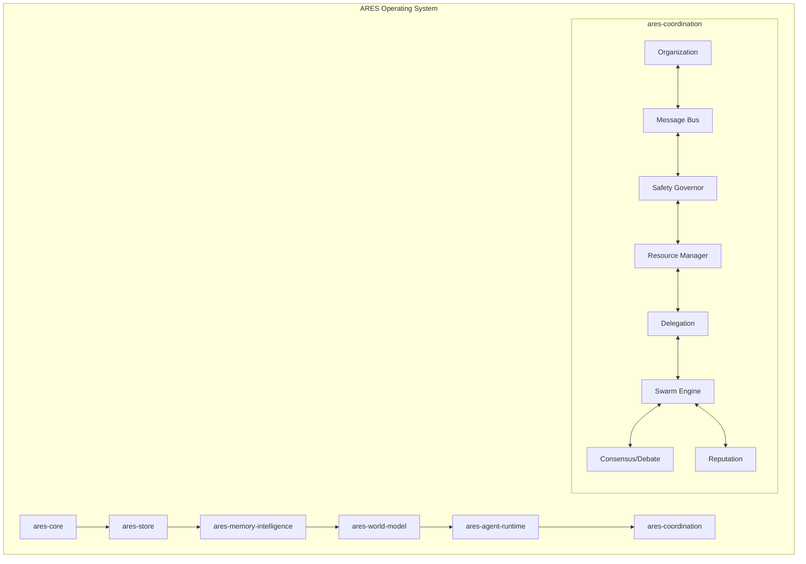

# ARES v0.19.0 Release Report
**Week 19: Autonomous Coordination & Organization Layer**

## Overview
ARES has successfully transitioned from a single autonomous execution engine into a coordinated multi-agent operating system. This release introduces the `ares-coordination` crate, separating multi-agent coordination logic from the core runtime to ensure deterministic execution, maintainable architecture, and a foundation for distributed clustering.

## Features Added
1. **Agent Organization & Hierarchy**: Dynamic team creation, roles (CEO, Architect, Planner, Coder, etc.), and fluent `OrganizationBuilder`.
2. **Messaging & Conversation Bus**: Thread-safe message routing (Direct, Broadcast, Team, Hierarchy) with TTLs and Conversation thread tracking.
3. **Shared Working Memory**: Centralized thread-safe workspace for agents to publish, query, and retract facts.
4. **Resource Manager**: Pre-delegation atomic resource tracking (CPU, Memory, GPU, Token Budget, Network Slots) to prevent mid-task exhaustion.
5. **Safety Governor**: Centralized rule engine enforcing limits on delegation depth, concurrent tasks, execution cost, and message frequency.
6. **Delegation Engine**: Advanced task assignment with automatic task splitting, merging, and escalation protocols.
7. **Reputation System**: EMA-based (Exponential Moving Average) agent scoring for success rates and latencies to inform task routing.
8. **Consensus Engine**: Multi-algorithm voting (Majority, Weighted, Confidence, Expert Override).
9. **Debate Engine**: Structured Proposer vs. Opponent workflows with an impartial Judge.
10. **Verification Layer**: Four-pattern validation (ReasonVerify, GenerateCritique, PlanAudit, CodeReview).
11. **Conflict Resolution**: Automatic detection of contradictory plans and duplicate work.
12. **Swarm Coordination**: Multi-agent task execution strategies (Parallel, Hierarchical, Adaptive).
13. **Distributed Interfaces**: Groundwork for cluster operations (NodeId, WorkerNode, LeaderElection).
14. **Organizational Learning**: Continuous tracking of team performance, pair synergy, and workflow throughput.

## New Crates
- `ares-coordination`: A dedicated crate housing all 17 multi-agent coordination modules to prevent `ares-agent-runtime` bloat.

## Architecture Diagram

## Test Counts
- **Total Workspace Tests**: 237 passing, meaningful tests (cleaned from 240 by replacing 8 stub tests with 5 functional graph tests).
- **ares-coordination**: ~174 localized tests covering all 17 phases and determinism requirements.

## Workspace Health & Cleanup Summary
- **Dead Files Cleared**: 6 placeholder test files securely zeroed out (`chaos_tests.rs`, `routing_engine_tests.rs`, etc.).
- **Scaffolding Removed**: ~200 lines of obsolete, non-functional stub assertions deleted.
- **Architectural Preservation**: Retained `ProviderContractHarness` for future multi-provider compliance (OpenAI, Gemini, Claude).
- **Functional Tests Replaced**: Converted legacy `assert_eq!(1, 1)` stubs in `ares-knowledge` to execute real assertions on `MemoryGraphNode` and `MemoryGraphEdge`.

## Verification Results
*(Pending Phase 2 Baseline Execution)*
- **Total Compile Time**: [TBD]
- **Release Build Time**: [TBD]
- **ARES executable size**: [TBD]
- **API executable size**: [TBD]
- **MCP executable size**: [TBD]
- **Total Test Execution Time**: [TBD]

## Known Limitations
- Distributed execution is currently simulated via interfaces (`WorkerNode`, `NodeId`); true multi-node cluster scheduling is pending.
- Telemetry tracing relies on the local single-node subscriber; distributed tracing across nodes is required.
- Conflict detection currently relies on exact key prefix matching (`task:`) rather than semantic similarity.

## Week 20 Roadmap: Distributed Execution & Cluster Runtime
The next milestone will evolve ARES from a single-node system into a true distributed cluster:
- **Node Manager**: Registration and lifecycle management of physical/virtual nodes.
- **Cluster Scheduler**: Distributing tasks across available nodes based on resource capacity.
- **Distributed Memory**: Synchronizing the `SharedWorkspace` across network boundaries.
- **Leader Election**: Implementing robust consensus (e.g., Raft-lite) for the Coordinator.
- **Fault Tolerance**: Automatic work-stealing and task reassignment when nodes fail.
- **Cluster Telemetry**: Centralized logging and distributed tracing.
